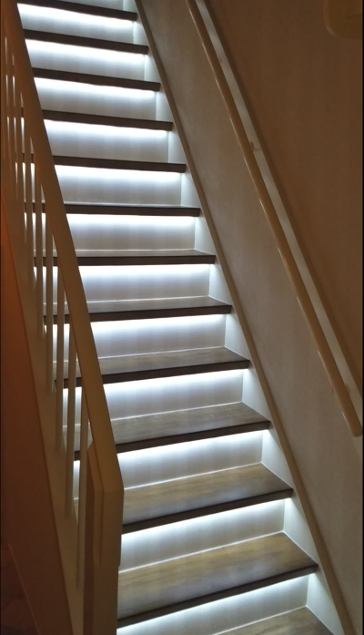

## Introduction
StairsJs is a minimal NodeJS app to automatically drive the stairs LED lights using 2 passive infra red detectors (PIRs) and uses the current sunset and sunrise times to activate the stair LED lights when someone enters the PIR detection zone.
It can run by it own (after installation no internet required). It uses 3rd party packages for logging (bunyan), determination of sunset and sunrise (suncalc) and of course a package for the input and output GPIO (onoff).

## Purpose 
The goal of this project is to build a nice led-light for my stairs (which I renovated recently) and to learn the raspberry PI, nodeJS and GPIO programming


## Hardware and Electric Scheme
List of each component with a link to specification and a global schematic overview with the list of used pin's of the raspberry PI can be found on the [wiki page](https://github.com/Vinz68/stairsJs/wiki)


## Pictures
 
 

## Installation notes

***Prerequisites***: You need node and npm installed on your RPI system. You can check if you have it installed in a terminal window with:

``` bash
node -v
npm -v
```

To install node + npm execute:
``` bash
curl -sL https://deb.nodesource.com/setup_9.x | sudo -E bash -
sudo apt-get install -y nodejs
```
See also [w3schools](https://www.w3schools.com/nodejs/nodejs_raspberrypi.asp) for more details to install raspbian and node.

***Installation steps:***

1. Fork this package to your github account and/or


2. Clone it from github to your server 
``` bash
git clone https://github.com/[your-account-name-here]/stairsJs.git
```


3. Install its dependencies 
```
npm install
```
NOTE: Use npm install --only=production to install only dependencies, and not devDependencies,regardless of the value of the NODE_ENV environment variable.


4. Run the program

use one of the following commands
``` bash
node stairsJs

npm start
```
or use PM2 (auto starts / auto restart the program after boot)
``` bash
pm2 start stairsJs.js
```
For the last option you need to install [PM2](http://pm2.keymetrics.io/)


5. Execute the unit- and integration tests (todo)
```
gulp test
```

## Contribute

Report a bug or a suggestion by posting an issue on the git repository (https://github.com/Vinz68/stairsJs/issues).

 
## TODO List:
 - [ ] include code quality check (JSLint or something else..)     
 - [ ] create a GUI client to show status and gain control of the stairs logic, using web-technology. This is currently under development, see [stairsJs-control-panel](https://github.com/Vinz68/stairsJs-control-panel)


If you used this to build your own stairs-led-light then send me a picture ; love to see it !.


 


